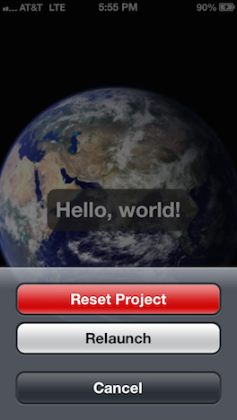

# CoronaViewer

CoronaViewer lets you edit your Corona project on your Mac/Win desktop and preview those code changes in __real-time__ on your __device__.

## Getting Started

### Dropbox Setup

CoronaViewer requires a [Dropbox](https://db.tt/uQgIqtPN) account. You'll need to install the Dropbox plugin on your desktop computer.

In terms of where your project files, we'll get to that in a second. There will be a special folder that's automatically created __after__ you launch the app and then login to Dropbox from your device.

### Running on device

Build the Corona project in this repo and install it on your device. ([Corona Enterprise](http://coronalabs.com/products/enterprise/) users, see below for additional info.)

You'll be prompted with Dropbox's standard login interface:

### First time launch

If this is the first time you launch the app, a special folder will be created on your Mac or Win computer:

	${DROPBOX_FOLDER}/Apps/CoronaViewer

This is where you should copy your Corona project files (e.g. `main.lua`) should go: `${DROPBOX_FOLDER}/Apps/CoronaViewer/main.lua`

NOTE: Only files in this location will be synchronized with your device. The rest of your Dropbox folder is __not__ visible to CoronaViewer.

### Automatic File Updates

The CoronaViewer will synchronize files between the device and the special Dropbox folder  on your desktop computer. During synchronization, CoronaViewer caches the files locally on the device. Files on the device are only updated the modification date of the incoming file is newer than the version of the file sitting locally on the device.

## CoronaViewer Actions

CoronaViewer has built-in actions that can be triggered by tapping the screen with 4 fingers (i.e. 4 simultaneous touches):

### Relaunch Project

The "Relaunch" action allows you to relaunch your app in CoronaViewer similar to how you relaunch it in the Corona Simulator.

### Reset Project (Switching Projects)

The "Reset Project" action is useful when you are switching projects. In some situations, CoronaViewer may appear to continue to use the files from your previous project instead of the files from your next project, i.e. the files you've just copied into the Dropbox folder on your desktop computer.

This can happen when a file's modification date is older than the version that's on the device, e.g. the `main.lua` from your previous project happened to be newer than the one from your next project.

If this happens, you can inform CoronaViewer to reset the project, thereby bypassing the modification date mechanism described above in 'Automatic File Updates'.

## Gotchas

### config.lua and build.settings

When running CoronaViewer, the `config.lua` and `build.settings` in your project (i.e. the files you copy into the special Dropbox folder) will __not__ be honored.

Instead, you need to modify `config.lua` and/or `build.settings` in __this__ CoronaViewer project and then rebuild CoronaViewer so your changes take effect.

## Additional Notes

### Xcode Simulator

CoronaViewer also works in the Xcode Simulator. You simply build CoronaViewer for Xcode Simulator instead of for your device.

### Corona Enterprise

If you are using Enterprise, you will need to add `libplugin_viewer.a`. This plugin is available from the Enterprise [daily builds](http://developer.coronalabs.com/downloads/daily-builds) page (click on the "Enterprise" tab).

This library should appear in the "Link Binary with Libraries" build phase of your app's Xcode project.

### iOS

#### Info.plist

On Enterprise, if you have overridden the `CFBundleURLTypes` array in your Info.plist, then you need to make sure that a `CFBundleURLSchemes` entry exists. It should correspond to the one in [build.settings](build.settings).

## Availability

### Supported Platforms

* iOS
* Android (TBD)

### Product Tiers

CoronaViewer is available to the following subscriptions/tiers:

* __Corona SDK (Pro)__
* __Corona Enterprise__
* __CoronaCards__ uses a slightly different workflow. [Learn more](https://github.com/coronacards/CoronaViewer)
